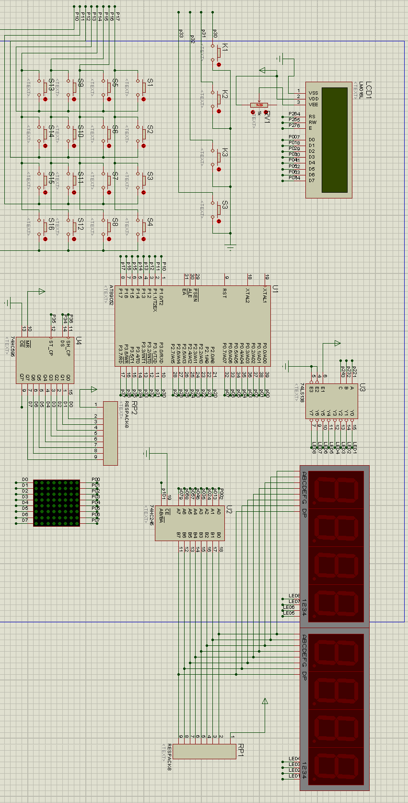

## 前言

&emsp;&emsp;这是本人在大二下学期，单人完成的 `STC89C52` 单片机课设，题目为 **抢答器**，由于当时时间比较仓促，代码实现上有些冗余部分，没有在代码设计上多花费功夫，把精力都放到功能点上。开发途中使用 `proteus` 仿真，在一个较为真实的硬件环境下模拟运行。

---

## 抢答器

#### 功能描述

&emsp;&emsp;实现八位选手抢答，抢答时间可以使用按键调整，采用 4 位数码管显示选手编号和抢答时间倒计时时间，设置主持人按键三个，功能依次为：复位、暂停、开始。

#### 基础要求

- [x] 用独立按键作为主持人按键；

- [x] 用数码管显示选手编号和倒计时时间；

- [x] LCD 显示选手姓名及其他信息；

- [x] 用 4*4 键盘作为抢答者同时抢答时按键的先后顺序，循环显示多个抢答者姓名等信息；

#### 发挥要求

- [x] 增加抢答人数，如 16 路抢答等；

- [x] 用 LCD 屏按照多个抢答者同时抢答时按键的先后顺序，循环显示多个抢答者姓名等信息；

- [x] 用 LED 点阵显示动态倒计时。

---

## 开发环境

- keil4
- proteus
- STC89c52学习板

---

## 抢答器--电路图

